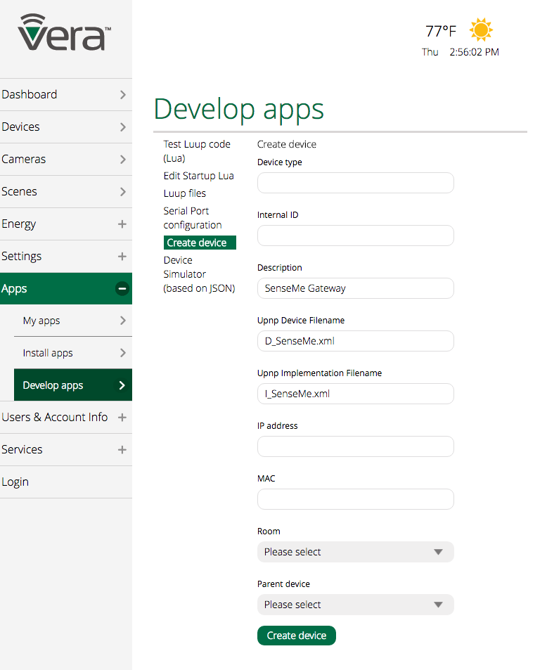

# Haiku Fans Plugin For VeraLite

This is a [VeraLite](http://getvera.com/controllers/veralite/) plugin for [Haiku Fans](https://www.haikuhome.com) From Big Ass Solutions.
Plugin supports fans and lights with SenseMe enabled. This is for UI7.
 
This is how your fans will display on the vera dashboard:


 
Fan lights display as a regular dimmer:


The SenseMe gateway device will display like this:


 
Currently the plugin fully support the lights and in addition to setting the fan speed, it allows switching the motion sensor, light sensor and whoosh mode. 
 
## Install 

Install and config is pretty manual.

### Download the necessary files

Download all the files in the [paxckage](plugin/package) directory

### Update the configs

In your local copy, update the file  `L_SenseMe.lua`. This file contains the core behaviors of the plugin and its configuration.
Look for the lua array `SENSEME_DEVICES` and create an entry for each of your fans. If your fan has the light module, create one entry for the fan using the "FAN" type and create one entry for the light using the "DIMMER" type. Use the same `SENSEME_NAME` for both entries.

If your network has issues with UDP broadcast, you will need to set the `SENSEME_IP` field with the ip address of each fan. Also I've noticed a better responsiveness when specifying the ip address. 

```
    {
      ID = "1", -- this needs to be unique. start with "1" and increase value for each new fan
      SENSEME_NAME = "Master Bedroom Fan", -- this is the name as it appears in your haiku app
      SENSEME_IP = "", -- this is the ip address of the fan. Leave blank to use broadcasting
      NAME = "Master Bedroom Fan", -- this is the name you want to see in your controller
      TYPE = "FAN", -- this must be "FAN" or "DIMMER"
      VID = 0, -- will be assigned during matching
    },
```
  
### Upload the plugin files to your vera

Go to the "Develop Apps" page on your controller and upload all the files you downloaded, except the `.png`. These are for icons and need to be uploaded to a different location,


  
### Upload the fan and device icons to your vera
  
This is optional - if you don't copy the icons to the controller, it will just display generic ones.
You will need to know the root password for your controller to do this. Here are the commands you would need to run from a linux command line. The IP of my controller is `192.168.1.108`, replace with yours:

```
scp haiku_fan_off.png root@192.168.1.108:/www/cmh/skins/default/img/devices/device_states/
scp haiku_fan_on.png  root@192.168.1.108:/www/cmh/skins/default/img/devices/device_states/
scp haiku.png  root@192.168.1.108:/www/cmh/skins/default/img/devices/device_states/
```

### Create the gateway device

Create the top level device. See below for the data points to enter. Once the device has been created, the luup engine should restart and your devices should appear. It takes a couple of minutes for the process to complete, be patient. 



### Adding a new fan

If you need to add a new fan. You can just add your fans to `L_SenseMe.lua` - as described above and just re-upload that file. The luup engine will restart and the plugin should pickup the changes.

### Removing a fan

Delete the device directly in your controller. Then update `L_SenseMe.lua` to remove the fan configuration and re-upload that file. The luup engine will restart and the plugin should pickup the changes.

## Thanks

 - https://github.com/sean9keenan/BigAssFansAPI - for all the SenseMe messages
 - http://bruce.pennypacker.org/2015/07/17/hacking-bigass-fans-with-senseme/ - for the great intro to SenseMe
 - http://www.lutron.com/en-US/Pages/default.aspx - This source code is based on the Caseta plugin 


